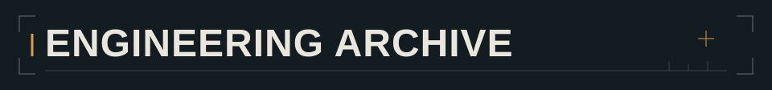

# DavidHLP

**Java Backend Developer · Java 后端开发者**

我开发 Java 后端服务与可复用组件，关注缓存行为、异步执行和服务边界，也参与前后端联调与 AI 辅助的全栈开发。

[博客](https://davidhlp.github.io/) · [项目](#01--精选项目) · [笔记](#03--技术笔记) · [English](README.md)

## 01 / 精选项目

### [ResiCache](https://github.com/DavidHLP/ResiCache)

面向 Spring Cache 的扩展组件，将 Redis 缓存防护组织为可组合的策略。

- **策略组合。** 通过有序、可配置的处理器责任链，将防护规则与缓存操作分离。
- **并发回源。** 启用 `sync=true` 时，同一 JVM 内相同键的请求共享加载结果；跨实例协调需要分布式锁后端。

**核心技术：** Java · Spring Cache · Redis · Redisson

项目处于早期阶段，API 可能调整。主分支面向 Spring Boot 4 / Java 21；使用已发布版本前需核对兼容性。

[加载实现](https://github.com/DavidHLP/ResiCache/blob/main/src/main/java/io/github/davidhlp/spring/cache/redis/cache/SyncSupport.java) · [兼容性与限制](https://github.com/DavidHLP/ResiCache/blob/main/COMPATIBILITY.md)

---

### [UltiCode](https://github.com/DavidHLP/UltiCode)

在线评测平台，支持提交代码并依据测试用例进行判题。

- **任务交付。** Outbox 路径将任务投递至 Redis Streams，投递失败时重试，对格式不完整的任务作死信处理。
- **执行边界。** 独立判题工作进程在 Docker 中运行提交代码，配置网络隔离以及 CPU、内存和进程数限制。

**核心技术：** Java · Spring Boot · Redis · Docker · Vue 3 · TypeScript

Core profile 是需要显式启用的架构实验，并非默认拓扑。项目没有生产环境。

[投递实现](https://github.com/DavidHLP/UltiCode/blob/main/services/submission/src/main/java/com/ulticode/modules/queue/outbox/dispatcher/JudgeOutboxDispatcher.java) · [项目状态与边界（中文）](https://github.com/DavidHLP/UltiCode/blob/main/docs/project/current-status.md)

## 02 / 工程方法

从明确的契约和失败场景出发，使用有针对性的测试、日志和可复现步骤检查改动。独立编写和调试代码，使用 AI 辅助探索与实现，并亲自审查其输出。

## 03 / 技术笔记

精选实现笔记。**两篇文章均为中文，保留原始标题。**

- [缓存击穿时，为什么要同时有 Future、分布式锁和 double-check？](https://davidhlp.github.io/note/resicache-single-flight/) — 请求合并、锁的作用范围与异常传播。
- [UltiCode Outbox 与 Redis Streams：把判题投递做成可恢复状态](https://davidhlp.github.io/note/ulticode-outbox-redis-streams/) — 持久化投递意图、重试与恢复边界。

[更多文章，请访问博客 →](https://davidhlp.github.io/)
